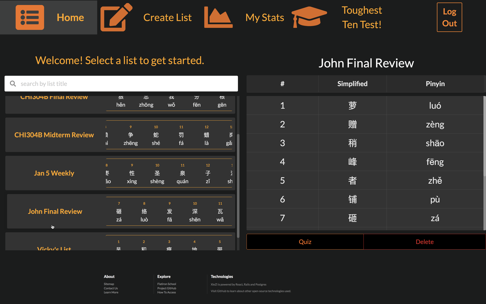
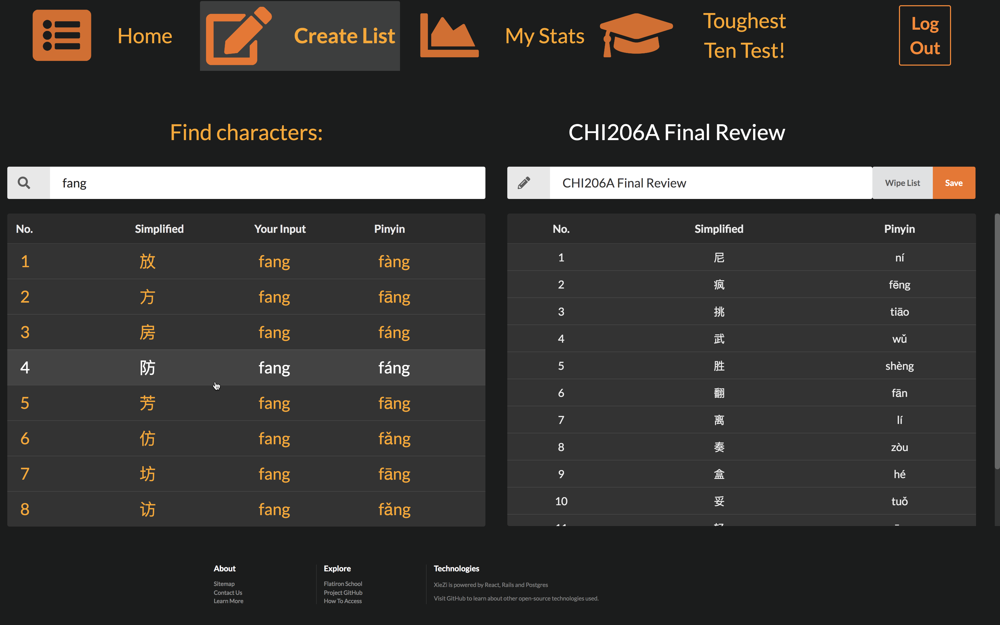
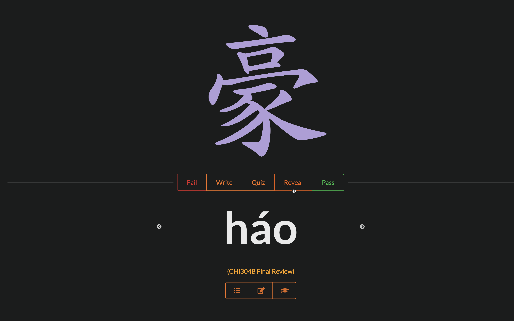
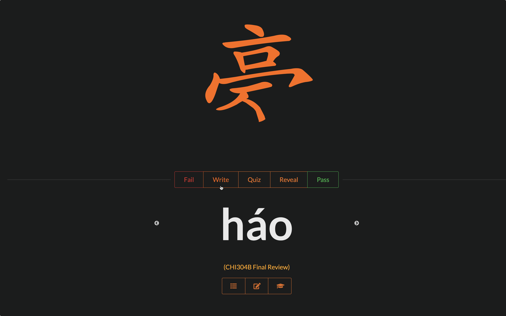
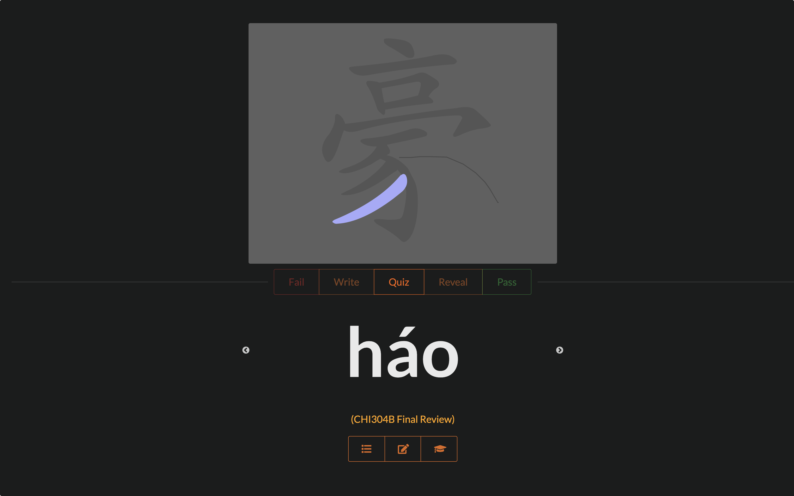

# [Video Demo](https://www.youtube.com/watch?v=bw7IBNXy3PM)

# XieZi

XieZi is a personal study tool that teaches students of Mandarin Chinese how to write characters.

Users create lists of characters to study by inputting a-tonal Pinyin (romanized, phoenetic 
references to characters) on the create list page. Every Pinyin entry fetches eight most likely characters from 
Google Transliterator API. The transliterator fetch then triggers a call to Pinyin node package, which retrieves 
and displays tonal Pinyin expressions for each character option.

Once the user stores lists, they can visit the list index page and scroll through preview cards representing each list.
They can also click any list to display its full contents in a large display pane, where they can also choose to
delete or take a quiz.

Quiz mode is a screen divided top and bottom. On bottom is a carousel from React Slick containing all Pinyin
prompts from the selected list. The user can tab through Pinyin expressions to practice each character from memory, ideally
with pencil and paper. On top, quiz mode has three basic functions: reveal, write, and quiz. Reveal 
renders a standardized-font SVG image of the character matching the current Pinyin slide. Write uses the same SVG
info to animate the character so it is written in the correct stroke order in real time. Quiz renders a canvas for 
the user to write the character with mouse strokes. If a stroke isn't accurate enough, the canvas hints the user by 
breifly flashing the proper SVG stroke in purple. If a stroke is good enough, the canvas renders a muted outline of that stroke
and the user can proceed to the next stroke, repeating until the character is written.

## Getting Started

The github version of XieZi comes pre-populated with character lists to quickly demonstrate the app.

While the 'list creator' screen is fully functional, you will not be able to actually save new lists in the demo.

Make sure to start the backend server first ( `rails s` ), then start the frontend with `yarn run start`. 
You will need [Postgres](https://www.postgresql.org/) up and running to run the backend.

Enjoy!

### Backend:

`bundle install` => `rake db:create` => `rake db:seed` => `rails s`

#### note: only run `rake db:seed` once! If you accidentally run it more than once, use the following command sequence:
`rake db:reset` => `rake db:create` => `rake db:seed` => `rails s`

### Frontend:

`npm install && npm start`

## Built With

* [React](https://reactjs.org/docs/getting-started.html) - frontend UI framework
* [Redux](https://redux.js.org/) - state management
* [Ruby on Rails](https://guides.rubyonrails.org/) - backend API framework
* [Semantic UI React](https://react.semantic-ui.com/) - styling
* [Hanzi Writer](https://github.com/chanind/hanzi-writer) - render character SVGs
* [Google Transliterate](https://www.npmjs.com/package/google-transliterate) - convert atonal Pinyin -> characters
* [Pinyin](https://www.npmjs.com/package/pinyin) - convert characters -> tonal Pinyin
* [React Slick](https://github.com/akiran/react-slick) - carousel component
* [React Vis](https://uber.github.io/react-vis/) - data visualization components

## License

While XieZi is not licensed, Hanzi Writer and its data are.

Hanzi Writer is released under an MIT license found [here](https://raw.githubusercontent.com/chanind/hanzi-writer/master/LICENSE).

The Hanzi Writer data comes from the Make Me A Hanzi project, which extracted the data from fonts by Arphic Technology, a Taiwanese font forge that released their work under a permissive license in 1999. You can redistribute and/or modify this data under the terms of the Arphic Public License as published by Arphic Technology Co., Ltd. A copy of this license can be found in [ARPHICPL.TXT](https://raw.githubusercontent.com/chanind/hanzi-writer-data/master/ARPHICPL.TXT).

## Acknowledgments

* The SVG-based functionality in quiz mode is thanks to a long list of technologies going back to 1999 when Arphic Technology opened up their
  font library. However, in my opinion a huge amount of credit goes to [chandind](https://github.com/chanind), who combined these technologies with his own
  original ideas to create the SVG animations and on-screen quizzes.

## Screen Caps

### Browse your lists, select a list to display in large format

### Create a new list

### Quiz reveal feature

### Quiz write feature

### Quiz quiz feature

